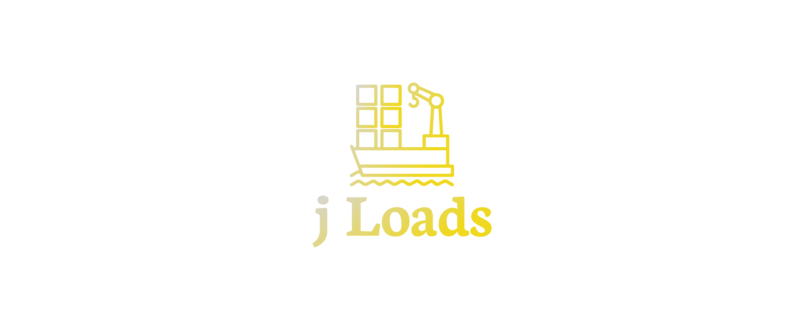
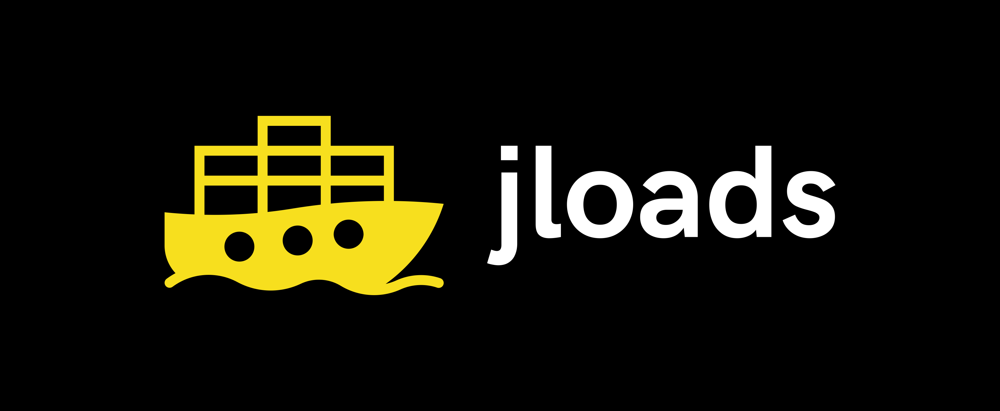

# logo
Concept of logo

## Font

Font in use <a target="_blank" href="https://fonts.google.com/specimen/Neuton">Neuton-Bold</a> designed by
<a target="_blank" href="https://brianskywalker.deviantart.com/">Brian Zick</a>
and licensed under
<a target="_blank" href="http://scripts.sil.org/cms/scripts/page.php?site_id=nrsi&amp;id=OFL_web">Open Font License.</a>
Icon Designed by
<a target="_blank" href="https://thenounproject.com/vectorsmarket">Vectors Market</a>

## Colors

### icon

    #4B4B4B, #efd81d

### background

    transparent
  
### font
  
  #4B4B4B, #efd81d
  
### css 

    p {
       font-family: 'HKGroteskRegular';
       font-weight: normal;
       font-style: normal;
    }

### html

    <link rel="stylesheet" media="screen" href="https://fontlibrary.org/face/hk-grotesk" type="text/css"/>
    
    
# Logo

## 1

## 2

## 3

## 4

## 6

## 5

